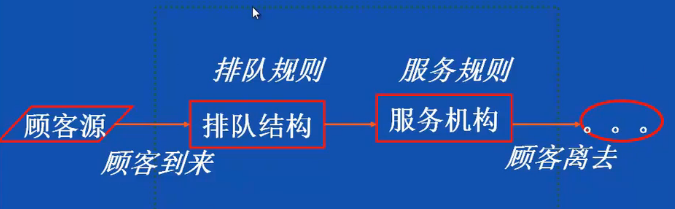
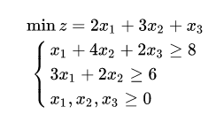

# 建模模型

# 1.层次分析法

定性问题定量化，用于求得权重值

<https://github.com/pyAHP/pyAHP>

# 2.多属性决策模型

先归一化属性值统一量纲，加权求和。权重可由成对比较矩阵得到。

# 3.灰色预测模型

<https://www.jianshu.com/p/a35ba96d852b>

## 灰色预测概述

灰色预测是用灰色模型GM(1,1)来进行定量分析的，通常分为以下几类：

1. 灰色时间序列预测。用等时距观测到的反映预测对象特征的一系列数量（如产量、销量、人口数量、存款数量、利率等）构造灰色预测模型，预测未来某一时刻的特征量，或者达到某特征量的时间。

2. 畸变预测（灾变预测）。通过模型预测异常值出现的时刻，预测异常值什么时候出现在特定时区内。

3. 波形预测，或称为拓扑预测，它是通过灰色模型预测事物未来变动的轨迹。

4. 系统预测，对系统行为特征指标建立一族相互关联的灰色预测理论模型，在预测系统整体变化的同时，预测系统各个环节的变化。

上述灰色预测方法的**共同特点**是：

1. 允许少数据预测；
2. 允许对灰因果律事件进行预测，例如：
   灰因白果律事件：在粮食生产预测中，影响粮食生产的因子很多，多到无法枚举，故为灰因，然而粮食产量却是具体的，故为白果。粮食预测即为灰因白果律事件预测。白因灰果律事件：在开发项目前景预测时，开发项目的投入是具体的，为白因，而项目的效益暂时不很清楚，为灰果。项目前景预测即为灰因白果律事件预测。
3. 具有可检验性，包括：建模可行性的级比检验（事前检验），建模精度检验（模型检验），预测的滚动检验（预测检验）。

# 4.dijkstra算法

点到点路径及距离

# 5.Floyd算法

可以对比印证

# 6.模拟退火模型

结合概率突跳特性在解空间中随机寻找全局最优解。

求解TSP问题：10个城市，从某个城市出发，最终回到这个城市，每个城市去一次，求最短路径。

# 7.种群竞争模型

种群竞争模型是当两个种群为争夺同一食物来源和生存空间相互竞争时，常见的结局是，优胜劣汰。使用种群竞争模型可以描述两个种群相互竞争的过程，分析产生各种结局的条件。

<https://blog.csdn.net/qq_39798423/article/details/89400206>

不同企业推出类似产品的销售情况可以应用种群竞争模型。

# 8.排队论

由于顾客到达和服务时间的随机性，现实中的排队现象几乎不可避免。排队过程，通常是一个随机过程，排队论又称为“随机服务系统理论”。

<https://github.com/HankerZheng/Basic-Calculator-for-Queueing-Theory>

# 9.线性规划

<https://www.jianshu.com/p/9be417cbfebb>

# 10.非线性规划与01规划

01规划问题即为线性规划链接中的指派问题

# 11.SPSS

主成分分析

聚类分析

多元回归分析

